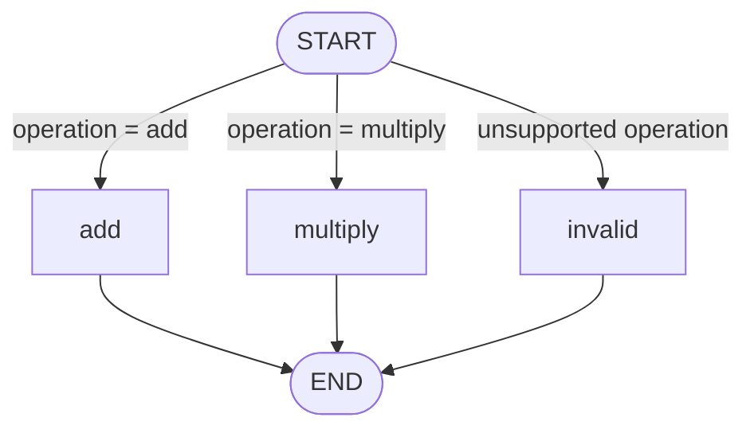

# Calculator LangGraph

```mermaid
flowchart TD
    START([START]) -->|operation = add| ADD[add]
    START -->|operation = multiply| MULTIPLY[multiply]
    START -->|unsupported operation| INVALID[invalid]

    ADD --> END_NODE([END])
    MULTIPLY --> END_NODE
    INVALID --> END_NODE
```

The `route_operation` function selects one of the three branches based on the
normalized `operation` value in `CalculatorState`.
